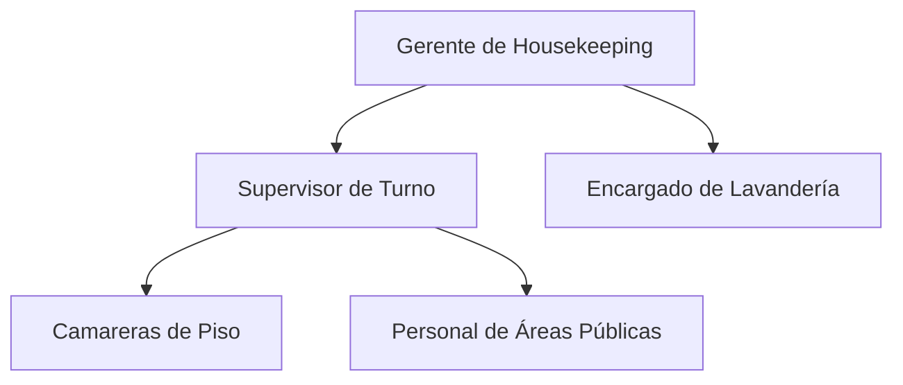

# Responsabilidades - Housekeeping

## Estructura del Departamento

### Organigrama

## Roles y Responsabilidades

### Gerente de Housekeeping

#### Responsabilidades Principales
- Supervisión general del departamento
- Gestión de personal y turnos
- Control de calidad y estándares
- Gestión de presupuesto y suministros

#### Responsabilidades Diarias
- Revisión de ocupación y asignaciones
- Supervisión de áreas
- Coordinación con otros departamentos

### Interacción con Otros Departamentos
- Recepción
  - Coordinación de estado de habitaciones
  - Reporte de incidencias
- Mantenimiento
  - Reporte de reparaciones
  - Seguimiento de trabajos

## Horarios y Turnos
- Turno mañana: 7:00 - 15:00
- Turno tarde: 15:00 - 23:00
- Rotación de fin de semana

## Capacitación y Desarrollo
- Inducción inicial obligatoria
- Capacitación en protocolos de limpieza
- Actualizaciones trimestrales
- Evaluación semestral

## Políticas Específicas
- Uso obligatorio de uniforme
- Protocolos de seguridad e higiene
- Manejo de objetos olvidados
- Confidencialidad