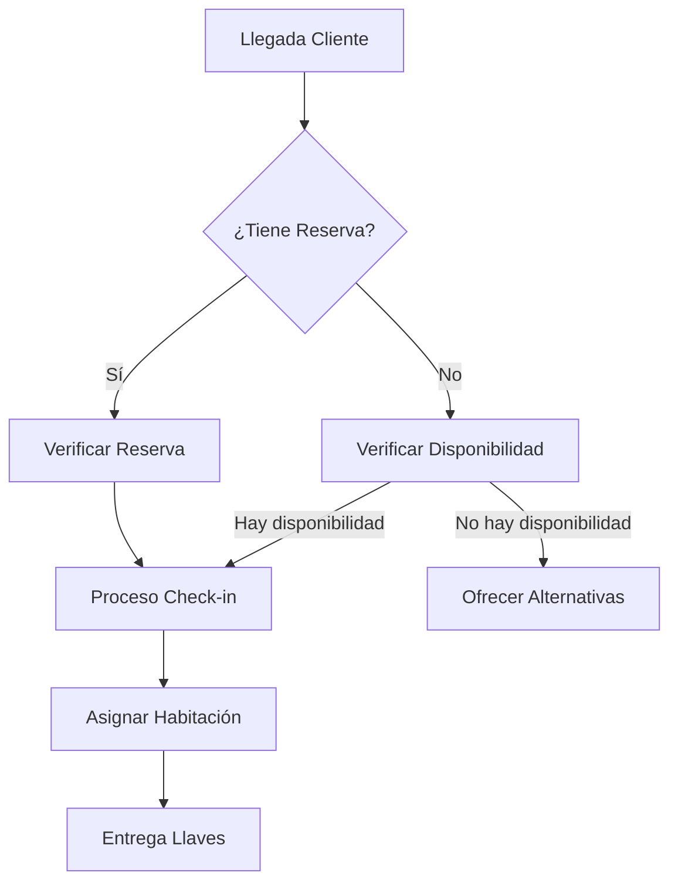

# Procesos de Recepción

## Procesos Principales

### 1. Check-in
1. Bienvenida al huésped
2. Verificación de reserva
3. Registro de documentación
4. Cobro y garantías
5. Entrega de llaves
6. Información del hotel

### 2. Check-out
1. Revisión de consumos
2. Generación de factura
3. Proceso de pago
4. Encuesta de satisfacción
5. Despedida

### 3. Reservas
1. Recepción de solicitud
2. Verificación de disponibilidad
3. Cotización
4. Confirmación
5. Seguimiento

### 4. Gestión de Habitaciones
1. Asignación
2. Coordinación con Housekeeping
3. Control de estado
4. Manejo de incidencias

## Flujos de Trabajo

## Estándares de Servicio

### Tiempos de Respuesta
- Check-in: 8 minutos máximo
- Check-out: 5 minutos máximo
- Respuesta a solicitudes: 10 minutos máximo
- Solución de incidencias: 30 minutos máximo