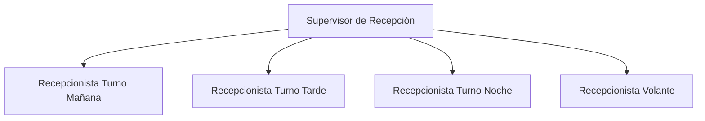

# Responsabilidades - Recepción

## Estructura del Departamento

### Organigrama

## Roles y Responsabilidades

### Supervisor de Recepción

#### Responsabilidades Principales
- Supervisión general del departamento
- Gestión de personal y turnos
- Manejo de situaciones especiales
- Coordinación con otros departamentos

#### Responsabilidades Diarias
- Revisión de reportes de turno
- Verificación de ocupación y tarifas
- Supervisión de estándares de servicio
- Control de caja y documentación

#### Responsabilidades Semanales
- Elaboración de horarios
- Análisis de KPIs
- Reuniones de coordinación
- Control de suministros

### Recepcionista

#### Responsabilidades Principales
- Atención al huésped
- Gestión de check-in/out
- Manejo de reservas
- Control de caja

#### Responsabilidades Diarias
- Verificar llegadas/salidas
- Actualizar estado de habitaciones
- Gestionar correspondencia
- Atender solicitudes de huéspedes

#### Responsabilidades por Turno

##### Turno Mañana (7:00 - 15:00)
- Gestión principal de check-out
- Actualización de housekeeping
- Reporte de ocupación diaria

##### Turno Tarde (15:00 - 23:00)
- Gestión principal de check-in
- Coordinación con restaurante
- Cierre de producción diaria

##### Turno Noche (23:00 - 7:00)
- Auditoría nocturna
- Reportes diarios
- Control de seguridad

### Interacción con Otros Departamentos

- Housekeeping
  - Coordinación de estados de habitación
  - Reporte de mantenimiento
  - Frecuencia: Continua

- Restaurante
  - Reservas de mesas
  - Cargos a habitación
  - Frecuencia: Diaria

- Mantenimiento
  - Reporte de averías
  - Seguimiento de reparaciones
  - Frecuencia: Según necesidad

## Horarios y Turnos
- Turno Mañana: 7:00 - 15:00
- Turno Tarde: 15:00 - 23:00
- Turno Noche: 23:00 - 7:00
- Descansos: 1 hora por turno
- Rotación: Mensual

## Capacitación y Desarrollo
- Inducción inicial: 1 semana
- Capacitación en sistemas: 2 semanas
- Evaluación mensual de desempeño
- Actualización semestral de procedimientos

## Políticas Específicas
- Puntualidad absoluta en cambios de turno
- Uniforme completo y presentación impecable
- Protocolo de comunicación estandarizado
- Manejo confidencial de información