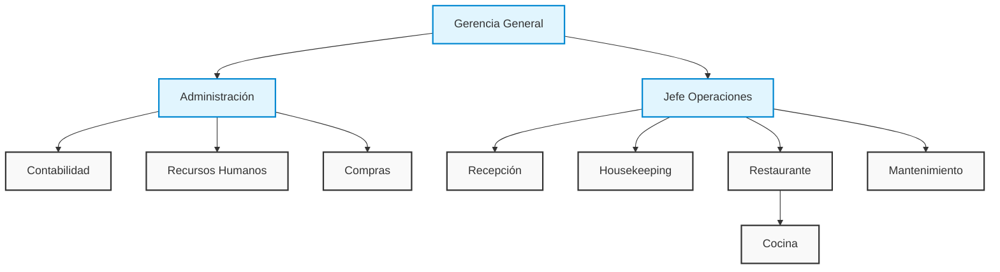

# Organigrama Hotel Italia

## Estructura Organizacional

### Niveles Jerárquicos
1. Gerencia General
   - Dirección estratégica
   - Toma de decisiones ejecutivas
   - Gestión de stakeholders

2. Jefaturas
   - Administración
   - Operaciones

3. Departamentos Operativos
   - Recepción
   - Housekeeping
   - Restaurante
   - Mantenimiento
   - Cocina

4. Departamentos Administrativos
   - Contabilidad
   - Recursos Humanos
   - Compras

## Roles y Responsabilidades

Cada posición en el organigrama tiene roles y responsabilidades claramente definidos siguiendo los principios de Holacracy:

- Autonomía en la toma de decisiones
- Responsabilidades claras
- Indicadores de desempeño medibles
- Objetivos alineados con la estrategia

Para más detalles sobre roles específicos, consultar la documentación de cada departamento.